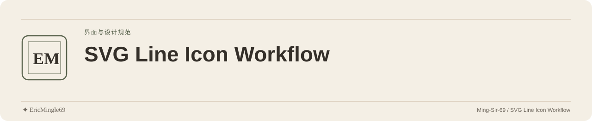

<picture>
  <source media="(prefers-color-scheme: dark)" srcset="readme-assets/header-dark.svg">
  <source media="(prefers-color-scheme: light)" srcset="readme-assets/header-light.svg">
  
</picture>

  <a href="README.md">简体中文</a> · <a href="README.en.md">English</a> · <a href="PERSONAL-NOTICE.md">✦ EricMingle69</a>

# SVG 线条图标工作流

## 项目定位

通过统一尺寸、笔画和颜色继承整理 Web 图标，提供 Skill 规范与集成示例。面向前端开发、界面设计与 AI Agent 协作。

## 阅读入口

| 入口 | 内容 |
| --- | --- |
| [图标工作流](SKILL.md) | 规范与五阶段流程 |
| [图标目录](examples/icon-catalog.md) | 现有分类与路径示例 |
| [集成示例](examples/resume-icons-demo.html) | HTML 内联图标示例 |

## 从哪里开始

1. 先审计已有图标并阅读 `SKILL.md`，确定分类和集成方式。
2. 用一个代表性图标验证尺寸、主题与笔画，再批量生成和集成检查。
3. 线条图标采用 `24×24 viewBox`、`stroke-width="2"`、圆角端点/连接与 `currentColor`。品牌图标另按填充风格处理。

## 使用边界

- 仓库是规范与示例，没有包管理配置、CLI 生成器或一键安装器。
- 图标的实际可读性、主题适配和无障碍说明需在目标界面中检查。
- SVG 路径的具体上游版本、许可与品牌使用范围仍需逐项核对。

## 来源与原有许可

原 `SKILL.md` 参考 Feather Icons / Lucide 的线条语言，品牌图标参考 Simple Icons 或官方 Logo。保留这些第三方与品牌归属；原仓库没有 LICENSE/NOTICE，不能为全部图标、路径和 Logo 提供统一授权。

---

文档维护：**✦ EricMingle69** · [Ming-Sir-69](https://github.com/Ming-Sir-69)  
[个人标识、许可与权限说明](PERSONAL-NOTICE.md) · 明暗页眉随 GitHub 主题自动切换。
